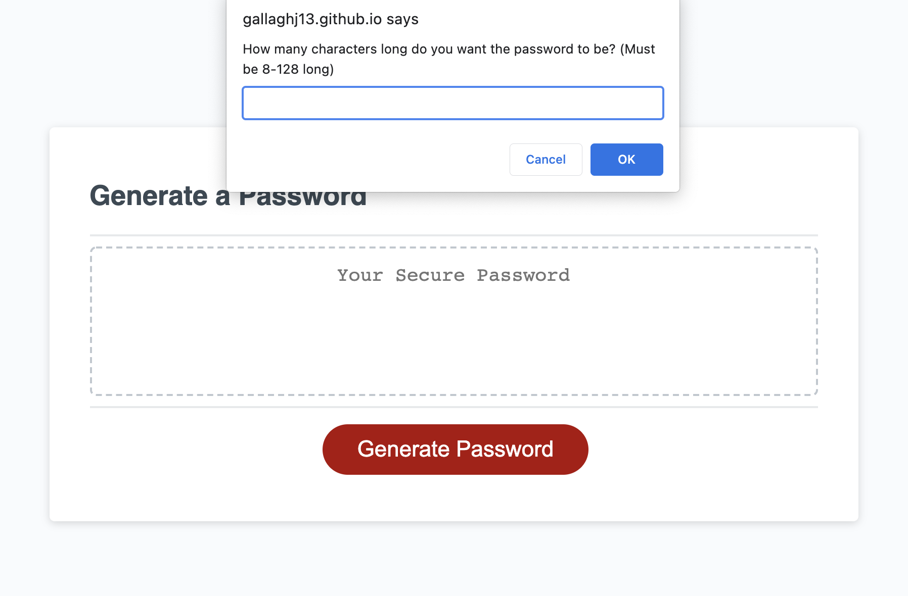
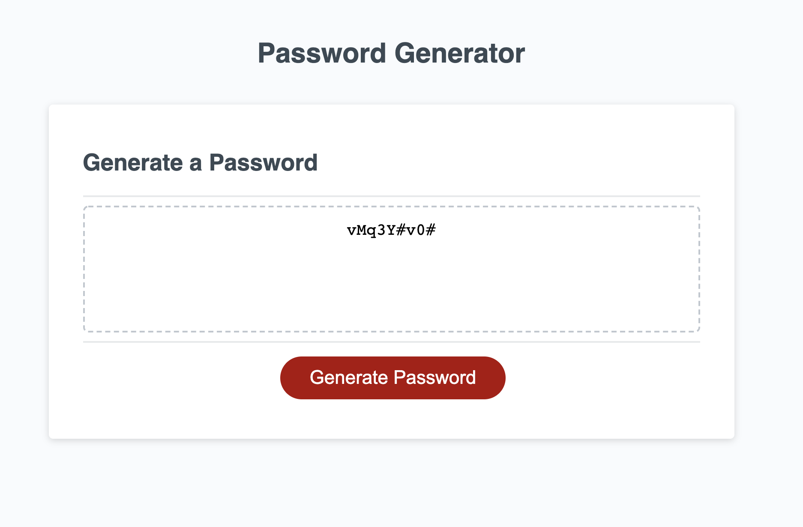

# Password-Generator

## Description
In this project, I created a random password generator with javascript. The HTML and CSS were provided along with a few lines of starter code in JS. The task was to develop the function that would generate a random password.

## Method
I started by creating the questions that would allow the user to specify the length of the password and the type of characters that it should contain. Then I created arrays for the potential characters and an empty array in which to store the password. The password is created through a while loop that goes through the conditions given by the user and adds random characters from those arrays. Once the length of the password is met, the password is then put through a function to randomize its order. Finally, the passsword is turned into a string and returned to the user.  

## Usage
The user clicks on the Generate Password button, which brings up the prompts that will be the criteria for the password:

Then the password produces a random password based on those criteria and displays it in the text box:

## Credits
- VSCode
- MDN Web Docs
- DelftStack: Tutorial on Randomizing an Array

## Links
URL for deployed website: https://gallaghj13.github.io/Password-Generator/